<h1 align="center">Hola, soy Matías Sione 👋</h1>

  <b>Desarrollador Full-Stack</b> — construyo aplicaciones web reales: integraciones de pago, plataformas multi-tenant y automatización.

  
  
  

---

### 🚀 Sobre mí

Desarrollador full-stack enfocado en llevar aplicaciones a **producción real** — de la base de datos al backend y la UI.

- 💻 Construyo apps web full-stack con **Next.js, TypeScript y Python**
- 🧩 Plataformas multi-tenant, integraciones de pago y automatización de workflows
- 🤝 Contribuyendo en **Solvant** y **Krownsoft**
- 🎓 Estudiando la **Tecnicatura Universitaria en Programación**
- 🌎 Argentina · 🗣️ Español (nativo)
- 🔗 **Mirá mi portfolio completo → [msione-portfolio.vercel.app](https://msione-portfolio.vercel.app)**

### 🛠️ Tech stack

**Frontend**  

**Backend**  

**Tools & DevOps**  

### 💼 Trabajo destacado

Algunas cosas que construí — write-ups completos en mi **[portfolio](https://msione-portfolio.vercel.app)**:

- 🗂️ **Plataforma de gestión de pedidos y producción** — dashboard web + app móvil, actualizaciones en tiempo real (WebSockets), control de acceso por roles y auditoría · `React` `FastAPI` `Flutter` `PostgreSQL`
- 📊 **Plataforma SaaS de reporting multi-tenant** — aislamiento por workspace con Row-Level Security, cifrado AES-256 y sync idempotente contra una API externa · `Next.js` `Supabase` `PostgreSQL`
- 🎨 **Frontend de plataforma de operaciones de marketing** — design system con brand tokens, previews pixel-perfect de redes y portal de aprobación con UX mobile · `Next.js` `React` `TypeScript`
- 📱 **App de estadísticas deportivas multiplataforma** — Android, iOS, web y escritorio desde una sola base de código, con auth JWT y 2FA · `Flutter` `Dart` `FastAPI`
- 🎫 **Plataforma de venta de entradas y control de acceso** — pago online + validación en puerta sin conexión y QR firmados con HMAC · `Next.js` `Supabase` `Mercado Pago`

### 📊 GitHub Metrics

  

### 🔥 Racha de commits

  

### 🏆 Trofeos

  

Estudiante de la Tecnicatura Universitaria en Programación.

